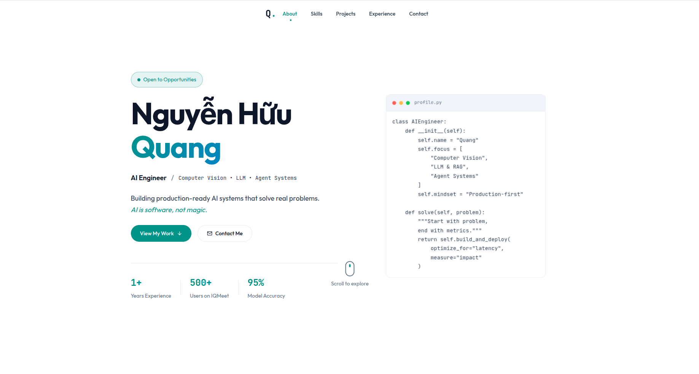

# Quang's AI Portfolio


A stunning, highly interactive 3D portfolio showcasing production-ready AI systems and LLM Agents. Built for technical recruiters, engineering managers, and open-source collaborators seeking an AI Engineer obsessed with latency, cost optimization, and reliability. Highlights concrete, real-world impact such as reducing video processing time by 90% and serving over 500 active SaaS users.


*(Placeholder: A high-quality GIF showing the 3D rotating elements, smooth page transitions via Framer Motion, and the project highlights section)*

## Key Features

- **Showcase technical expertise immersively** using React Three Fiber and 3D rendering for a memorable user experience.
- **Navigate complex AI projects smoothly** with Framer Motion animations creating fluid, dynamic web layouts.
- **Discover production metrics instantly** including mAP scores (0.857), Word Error Rates (< 15%), and real-time processing latencies.
- **Deploy lightning-fast** using Vite's optimized, modern frontend build pipeline.
- **Highlight core engineering mindsets effectively**, proving a dedication to Production-First, End-to-End, and Problem-Driven AI development.
- **Maintain pristine code quality easily** with strict ESLint configurations tailored for React hooks and modern JS globals.

## Quick Start

Launch the 3D portfolio locally in under 2 minutes.

**1. Clone and Install**
```bash
git clone https://github.com/quangkmhd/portfolio_quang.git
cd portfolio_quang
npm install
```

**2. Start Development Server**
```bash
npm run dev
```

**3. Expected Output**
```text
  VITE v7.2.4  ready in 350 ms

  ➜  Local:   http://localhost:5173/
  ➜  Network: use --host to expose
```
*Open `http://localhost:5173/` in your browser. You will immediately see the interactive 3D hero section and the "AI is software, not magic" slogan.*

## Installation

### Method 1: Using NPM (Standard)
```bash
npm install
npm run dev
```

### Method 2: Using Yarn
```bash
yarn install
yarn dev
```

### Method 3: Using PNPM (Fastest)
```bash
pnpm install
pnpm dev
```

## Usage Examples

### 1. Customizing Content
Update the portfolio text without touching the complex 3D logic.
```javascript
// Open src/data/content.js (or equivalent)
export const HERO_DATA = {
  name: "Nguyen Huu Quang",
  role: "AI Engineer / Computer Vision • LLM • Agent Systems",
  slogan: "Building production-ready AI systems that solve real problems."
};
```
*Explanation: The architecture separates content from presentation, allowing rapid updates as new AI projects are deployed.*

### 2. Modifying 3D Elements
Tweak the `react-three-fiber` canvas to change the visual aesthetic.
```jsx
// Inside your Three.js component
import { Canvas } from '@react-three/fiber'
import { OrbitControls, Sphere } from '@react-three/drei'

export default function Hero3D() {
  return (
    <Canvas>
      <ambientLight intensity={0.5} />
      <Sphere args={[1, 32, 32]}>
        <meshStandardMaterial color="hotpink" wireframe />
      </Sphere>
      <OrbitControls autoRotate />
    </Canvas>
  )
}
```
*Explanation: Leverage `@react-three/drei` helpers to quickly prototype and render impressive 3D geometry with minimal WebGL boilerplate.*

### 3. Production Build
Prepare the application for fast, static CDN hosting.
```bash
npm run build
```
*Expected output is a highly minified `dist/` folder ready for Vercel, Netlify, or GitHub Pages deployment.*

## Troubleshooting

**Error: `THREE.WebGLRenderer: Error creating WebGL context.`**
* **Cause**: Hardware acceleration is disabled in your browser or your GPU drivers are outdated.
* **Fix**: Enable hardware acceleration in Chrome/Firefox settings, or test the portfolio on a different device to confirm WebGL support.

**Error: ESLint warnings blocking build**
* **Cause**: `eslint-plugin-react-hooks` detected a missing dependency array in a `useEffect`.
* **Fix**: Run `npm run lint` to see the exact file and line, then add the necessary variable to the dependency array.

**Error: Out of Memory during `npm install`**
* **Cause**: Large three.js and framer-motion dependencies on restricted environments (like small CI runners).
* **Fix**: Use `npm ci` for a clean install or increase Node's memory limit.

## 📚 Documentation Links

### 🏗️ [System Architecture](./docs/ARCHITECTURE.md)
Take a comprehensive look under the hood of this immersive 3D portfolio. This guide breaks down the complex integration of React Three Fiber and Framer Motion, detailing how high-fidelity 3D assets are rendered without sacrificing performance. Discover our aggressive optimization strategies that maintain fluid transitions and lightning-fast Vite build pipelines.

### 🔌 [API Reference](./docs/API_REFERENCE.md)
Access the core data structures and content delivery methods that drive the portfolio's dynamic UI. This reference meticulously outlines the data models for project highlights, production metrics, and content injection payloads. Learn how the architecture separates static content from WebGL rendering logic, enabling rapid, code-free content updates.

### ⚙️ [Configuration Guide](./docs/CONFIGURATION.md)
Master the development and deployment lifecycle of this modern React application. We dive into the strict ESLint configurations, environment setups, and Vite plugin tuning required to maintain pristine code quality. Learn how to configure your build for optimal static CDN hosting and resolve common WebGL hardware acceleration hurdles.

## Contributing

While this is a personal portfolio, UI/UX suggestions and performance optimizations are welcome!
1. Fork the repo.
2. Create a branch (`git checkout -b perf-improvement`).
3. Commit optimizations.
4. Open a Pull Request for review.

## License

This project is licensed under the MIT License. Feel free to use the structure for your own portfolio.

## Credits

Special thanks to the Poimandres collective for `@react-three/fiber` and `@react-three/drei`, which make 3D web development incredibly elegant.
